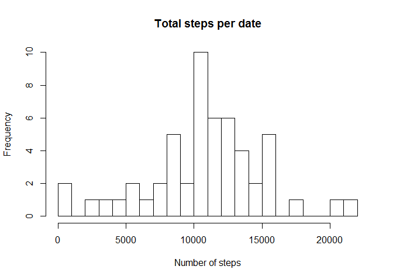
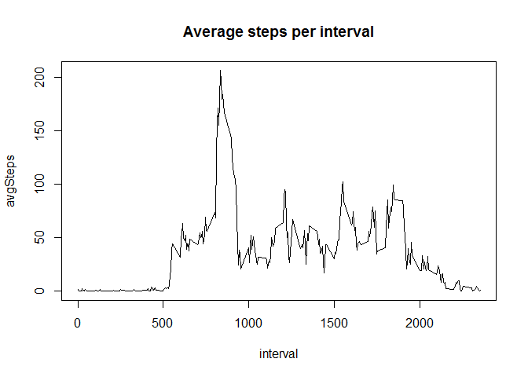
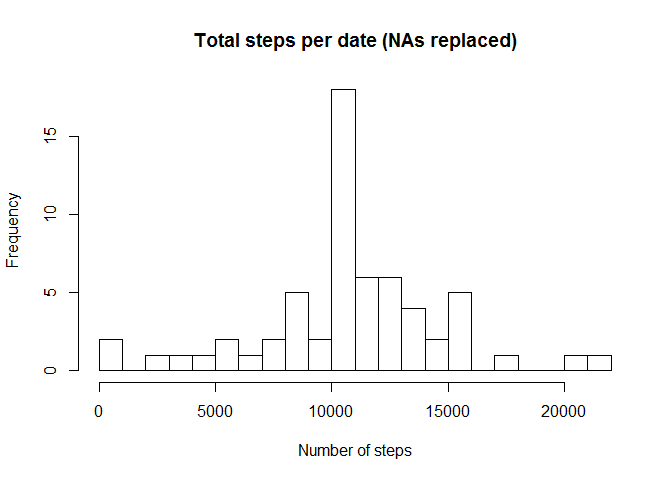
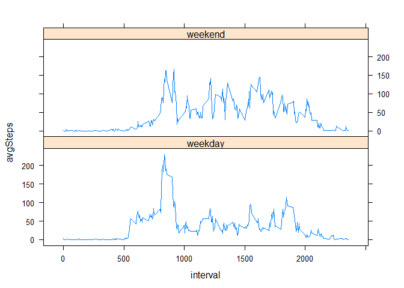

## Loading and preprocessing the data
The data is downloaded in a zip file, containing a CSV formatted file, comma separated. To avoid errors when it's re-run, it is overwritten if it exists already.


```r
unzip("activity.zip", overwrite=TRUE)
data<-read.csv("activity.csv")
str(data)
```

```
## 'data.frame':	17568 obs. of  3 variables:
##  $ steps   : int  NA NA NA NA NA NA NA NA NA NA ...
##  $ date    : Factor w/ 61 levels "2012-10-01","2012-10-02",..: 1 1 1 1 1 1 1 1 1 1 ...
##  $ interval: int  0 5 10 15 20 25 30 35 40 45 ...
```

```r
summary(data)
```

```
##      steps                date          interval     
##  Min.   :  0.00   2012-10-01:  288   Min.   :   0.0  
##  1st Qu.:  0.00   2012-10-02:  288   1st Qu.: 588.8  
##  Median :  0.00   2012-10-03:  288   Median :1177.5  
##  Mean   : 37.38   2012-10-04:  288   Mean   :1177.5  
##  3rd Qu.: 12.00   2012-10-05:  288   3rd Qu.:1766.2  
##  Max.   :806.00   2012-10-06:  288   Max.   :2355.0  
##  NA's   :2304     (Other)   :15840
```

```r
head(data)
```

```
##   steps       date interval
## 1    NA 2012-10-01        0
## 2    NA 2012-10-01        5
## 3    NA 2012-10-01       10
## 4    NA 2012-10-01       15
## 5    NA 2012-10-01       20
## 6    NA 2012-10-01       25
```

## What is mean total number of steps taken per day?

First, it is used the aggregate function to calculate the total number of steps per date, which will ignore by default NA values. 


```r
# Aggregate total steps per day, and create an histogram (NAs not removed)
stepsPerDate<-aggregate(steps ~ date, sum, data = data)
names(stepsPerDate)<-c("date", "totalSteps")
```

Second, an histogram is created showing the distribution of the measures taken each day.


```r
# Aggregate total steps per day, and create an histogram (NAs not removed)
stepsPerDate<-aggregate(steps ~ date, sum, data = data)
names(stepsPerDate)<-c("date", "totalSteps")
hist(stepsPerDate$totalSteps, main = "Total steps per date", xlab = "Number of steps", breaks = 20)
```

<!-- -->

Last, mean and median are calculated.


```r
mean(stepsPerDate$totalSteps)
```

```
## [1] 10766.19
```

```r
median(stepsPerDate$totalSteps)
```

```
## [1] 10765
```
## What is the average daily activity pattern?

First, it is used the aggregate function to calculate the total number of steps per interval, whch will ignore by default NA values.


```r
avgPerInterval<-aggregate(steps ~ interval, mean, data = data)
names(avgPerInterval)<-c("interval", "avgSteps")
```

Second, a time series plot is created of the 5-minute interval (x-axis) and the average number of steps taken, averaged across all days (y-axis).


```r
with(avgPerInterval, plot(interval, avgSteps, type = "l", main = "Average steps per interval"))
```

<!-- -->

Last, it is identified the 5-minute interval, on average across all the days in the dataset, contains the maximum number of steps.


```r
avgPerInterval[max(avgPerInterval$avgSteps),]
```

```
##     interval avgSteps
## 206     1705 56.30189
```

## Imputing missing values

Number of missing values can be calculated easily using summary, or with a quick sum of the NA values.


```r
summary(data)
```

```
##      steps                date          interval     
##  Min.   :  0.00   2012-10-01:  288   Min.   :   0.0  
##  1st Qu.:  0.00   2012-10-02:  288   1st Qu.: 588.8  
##  Median :  0.00   2012-10-03:  288   Median :1177.5  
##  Mean   : 37.38   2012-10-04:  288   Mean   :1177.5  
##  3rd Qu.: 12.00   2012-10-05:  288   3rd Qu.:1766.2  
##  Max.   :806.00   2012-10-06:  288   Max.   :2355.0  
##  NA's   :2304     (Other)   :15840
```

```r
sum(is.na(data$steps))
```

```
## [1] 2304
```

The missing values will be replaced by the mean of the interval. In order to do that, a function "lookp.value"" is defined, that receives the value of the interval and the interval, and will lookup for the mean value of that interval in the already calculated aggregation of steps per interval.


```r
# look up function to find the mean for that interval
lookup.value <- function(steps, interval) {
   value <- NA
   if (!is.na(steps))
      value <- steps 
   else 
      value <- avgPerInterval[avgPerInterval$interval == interval,]$avgSteps
      return(value)
}
# Create a new variable where the NAs are replaced. using mapply to apply lookup.value function to each row
no_na_data <- data
no_na_data$steps <- mapply(lookup.value, no_na_data$steps, no_na_data$interval)
```

An histogram can be created again as in previous steps, but using the new dataset created. Also, mean and median are showed.


```r
no_na_stepsPerDate<-aggregate(steps ~ date, sum, data = no_na_data)
names(no_na_stepsPerDate)<-c("date", "totalSteps")
hist(no_na_stepsPerDate$totalSteps, main = "Total steps per date (NAs replaced)", xlab = "Number of steps", breaks = 20)
```

<!-- -->

```r
mean(no_na_stepsPerDate$totalSteps)
```

```
## [1] 10766.19
```

```r
median(no_na_stepsPerDate$totalSteps)
```

```
## [1] 10766.19
```

It can be seen in the histogram that now there are more measures available now. *The mean hasn't change, and the median has increased slightly up to the mean value. This is understandable since the mean have been used to fill the NA values.*

## Are there differences in activity patterns between weekdays and weekends?

First, it is needed to include a new column with a factor that represents the type of day. This can be done easily using function "mutate" from the package "lubridate", and "wday from the package "dplyr.


```r
require(lubridate)
require(dplyr)
no_na_data_mutated <-mutate(no_na_data, day = ifelse(wday(no_na_data$date) %in% c(2:6), "weekday", "weekend"))
no_na_data_mutated$day<-as.factor(no_na_data_mutated$day)
```

Second, it is needed to aggregate again the mean per interval, but in this case taking into account also the day type.


```r
avgPerIntervalWday<-aggregate(steps ~ interval+day, mean, data = no_na_data_mutated)
names(avgPerIntervalWday)<-c("interval", "day", "avgSteps")
```

Last, a time series plot is created distinguishing between weekday and weekend. Usig "Lattice" plotting system to match README.md example

```r
require(lattice)
xyplot(avgSteps ~ interval | day, data = avgPerIntervalWday, layout = c(1,2), type = "l")
```

<!-- -->
